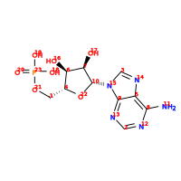

The isoenum Docker Tutorial
===========================

The isoenum docker container
~~~~~~~~~~~~~~~~~~~~~~~~~~~~

This section contains the examples provided above but with the use of a docker
container with ``isoenum`` Python package and all its dependencies instead of using
``isoenum`` Python package directly.

After you ``docker pull`` or ``docker build`` the ``isoenum`` container, you can verify
that it is available.

.. code-block:: none

   # docker images

You should see output similar to the following:

.. code-block:: none

   REPOSITORY          TAG                 IMAGE ID            CREATED             SIZE
   isoenum             latest              0e4c431aa519        1 day ago           862MB

Command-line interface
~~~~~~~~~~~~~~~~~~~~~~

The ``isoenum`` package provides an easy-to-use command-line interface
that allows the specification of isotopes for the creation of
isotopically-resolved ``InChI``.

* To access the ``isoenum`` command-line interface from docker container:

.. code-block:: none

    # docker run isoenum --help

Output:

.. code-block:: none

   Isotopic enumerator (isoenum) command-line interface

   Usage:
       isoenum -h | --help
       isoenum --version
       isoenum name (<path-to-ctfile-file-or-inchi-file-or-inchi-string>)
                    [--specific=<isotope:element:position>...]
                    [--all=<isotope:element>...]
                    [--enumerate=<isotope:element:min:max>...]
                    [--complete | --partial]
                    [--ignore-iso]
                    [--format=<format>]
                    [--output=<path>]
                    [--verbose]
       isoenum ionize (<path-to-ctfile-file-or-inchi-file-or-inchi-string>)
                   (--state=<element:position:charge>)
                   [--format=<format>]
                   [--output=<path>]
       isoenum nmr (<path-to-ctfile-file-or-inchi-file-or-inchi-string>)
                   [--type=<experiment-type>]
                   [--jcoupling=<name>...]
                   [--decoupled=<element>...]
                   [--format=<format>]
                   [--output=<path>]
                   [--subset]
                   [--verbose]

   Options:
       -h, --help                                 Show this screen.
       --verbose                                  Print more information.
       -v, --version                              Show version.
       -a, --all=<isotope:element>                Specify element and isotope, e.g. -a 13:C or --all=13:C
       -s, --specific=<isotope:element:position>  Specify element, isotope and specific position,
                                                  e.g. -s 13:C:1 or --specific=13:C:1.
       -e, --enumerate=<isotope:element:min:max>  Enumerate all isotopically-resolved CTfile or InChI,
                                                  e.g. -e 13:C:2:4 or --enumerate=13:C:2:4
       -c, --complete                             Use complete labeling schema, i.e. every atom must specify
                                                  "ISO" property, partial labeling schema will be used otherwise
                                                  for specified labeling information only.
       -p, --partial                              Use partial labeling schema, i.e. generate labeling schema
                                                  from the provided labeling information.
       -i, --ignore-iso                           Ignore existing "ISO" specification in the CTfile or InChI.
       -f, --format=<format>                      Format of output: inchi, mol, sdf, csv, json [default: inchi].
       -o, --output=<path>                        Path to output file.
       -t, --type=<experiment-type>               Type of NMR experiment [default: 1D1H].
       -j, --jcoupling=<type>                     Allowed J couplings.
       -d, --decoupled=<element>                  Turn off J coupling for a given element.
       -z, --state=<element:position:charge>      Create ionized form of InChI from neutral molecule,
                                                  e.g. N:6:+1, O:8:-1.
       --subset                                   Create atom subsets for each resonance.

Docker usage examples
~~~~~~~~~~~~~~~~~~~~~

Input files
-----------

We will use the same input files as above to generate isotopically-resolved
``InChI``. Repeated here for convenience.

* ``Molfile`` example:

.. code-block:: none

    pentane-2_2-diol
    OpenBabel02101812223D

     19 18  0  0  0  0  0  0  0  0999 V2000
        0.8986   -0.0477    0.0323 C   0  0  0  0  0  0  0  0  0  0  0  0
        5.0960    0.7629    2.7277 C   0  0  0  0  0  0  0  0  0  0  0  0
        2.4213   -0.0579   -0.0025 C   0  0  0  0  0  0  0  0  0  0  0  0
        3.0115    0.3840    1.3416 C   0  0  0  0  0  0  0  0  0  0  0  0
        4.5473    0.3524    1.3660 C   0  0  0  0  0  0  0  0  0  0  0  0
        4.9506   -0.9689    1.0442 O   0  0  0  0  0  0  0  0  0  0  0  0
        5.0892    1.2477    0.4081 O   0  0  0  0  0  0  0  0  0  0  0  0
        0.4966   -0.3656   -0.9348 H   0  0  0  0  0  0  0  0  0  0  0  0
        0.5151    0.9566    0.2461 H   0  0  0  0  0  0  0  0  0  0  0  0
        0.5209   -0.7306    0.7986 H   0  0  0  0  0  0  0  0  0  0  0  0
        4.7913    0.0636    3.5124 H   0  0  0  0  0  0  0  0  0  0  0  0
        4.7734    1.7738    2.9979 H   0  0  0  0  0  0  0  0  0  0  0  0
        6.1923    0.7728    2.7063 H   0  0  0  0  0  0  0  0  0  0  0  0
        2.7620    0.6098   -0.8011 H   0  0  0  0  0  0  0  0  0  0  0  0
        2.7573   -1.0707   -0.2471 H   0  0  0  0  0  0  0  0  0  0  0  0
        2.6291   -0.2841    2.1226 H   0  0  0  0  0  0  0  0  0  0  0  0
        2.6589    1.3989    1.5754 H   0  0  0  0  0  0  0  0  0  0  0  0
        5.5197   -1.2976    1.7554 H   0  0  0  0  0  0  0  0  0  0  0  0
        4.6303    2.0937    0.5065 H   0  0  0  0  0  0  0  0  0  0  0  0
      1  3  1  0  0  0  0
      1  8  1  0  0  0  0
      1  9  1  0  0  0  0
      1 10  1  0  0  0  0
      2  5  1  0  0  0  0
      2 11  1  0  0  0  0
      2 12  1  0  0  0  0
      2 13  1  0  0  0  0
      3  4  1  0  0  0  0
      3 14  1  0  0  0  0
      3 15  1  0  0  0  0
      4  5  1  0  0  0  0
      4 16  1  0  0  0  0
      4 17  1  0  0  0  0
      5  6  1  0  0  0  0
      5  7  1  0  0  0  0
      6 18  1  0  0  0  0
      7 19  1  0  0  0  0
    M  ISO  1   1  12
    M  END

* Text file containing ``InChI`` string:

.. code-block:: none

    InChI=1S/C5H12O2/c1-3-4-5(2,6)7/h6-7H,3-4H2,1-2H3

* ``SDfile`` (i.e. ``Molfile`` plus data) example:

.. code-block:: none

    pentane-2_2-diol
    OpenBabel02101812223D

     19 18  0  0  0  0  0  0  0  0999 V2000
        0.8986   -0.0477    0.0323 C   0  0  0  0  0  0  0  0  0  0  0  0
        5.0960    0.7629    2.7277 C   0  0  0  0  0  0  0  0  0  0  0  0
        2.4213   -0.0579   -0.0025 C   0  0  0  0  0  0  0  0  0  0  0  0
        3.0115    0.3840    1.3416 C   0  0  0  0  0  0  0  0  0  0  0  0
        4.5473    0.3524    1.3660 C   0  0  0  0  0  0  0  0  0  0  0  0
        4.9506   -0.9689    1.0442 O   0  0  0  0  0  0  0  0  0  0  0  0
        5.0892    1.2477    0.4081 O   0  0  0  0  0  0  0  0  0  0  0  0
        0.4966   -0.3656   -0.9348 H   0  0  0  0  0  0  0  0  0  0  0  0
        0.5151    0.9566    0.2461 H   0  0  0  0  0  0  0  0  0  0  0  0
        0.5209   -0.7306    0.7986 H   0  0  0  0  0  0  0  0  0  0  0  0
        4.7913    0.0636    3.5124 H   0  0  0  0  0  0  0  0  0  0  0  0
        4.7734    1.7738    2.9979 H   0  0  0  0  0  0  0  0  0  0  0  0
        6.1923    0.7728    2.7063 H   0  0  0  0  0  0  0  0  0  0  0  0
        2.7620    0.6098   -0.8011 H   0  0  0  0  0  0  0  0  0  0  0  0
        2.7573   -1.0707   -0.2471 H   0  0  0  0  0  0  0  0  0  0  0  0
        2.6291   -0.2841    2.1226 H   0  0  0  0  0  0  0  0  0  0  0  0
        2.6589    1.3989    1.5754 H   0  0  0  0  0  0  0  0  0  0  0  0
        5.5197   -1.2976    1.7554 H   0  0  0  0  0  0  0  0  0  0  0  0
        4.6303    2.0937    0.5065 H   0  0  0  0  0  0  0  0  0  0  0  0
      1  3  1  0  0  0  0
      1  8  1  0  0  0  0
      1  9  1  0  0  0  0
      1 10  1  0  0  0  0
      2  5  1  0  0  0  0
      2 11  1  0  0  0  0
      2 12  1  0  0  0  0
      2 13  1  0  0  0  0
      3  4  1  0  0  0  0
      3 14  1  0  0  0  0
      3 15  1  0  0  0  0
      4  5  1  0  0  0  0
      4 16  1  0  0  0  0
      4 17  1  0  0  0  0
      5  6  1  0  0  0  0
      5  7  1  0  0  0  0
      6 18  1  0  0  0  0
      7 19  1  0  0  0  0
    M  ISO  1   1  12
    M  END
    > <InChI>
    InChI=1S/C5H12O2/c1-3-4-5(2,6)7/h6-7H,3-4H2,1-2H3/i1+0

    $$$$

Input file/string specification
-------------------------------

As shown above, the ``isoenum`` command-line interface asks the user
to provide one required parameter ``<path-to-ctfile-file-or-inchi-file-or-inchi-string>``,
which is the file or string with information required to create isotopically-resolved ``InChI``.

In order to provide the input file path to the ``isoenum`` docker container,
you will need to mount it as a volume for the docker container so the container can see it.

.. warning::

   You need to provide the absolute path to the input file, otherwise the docker container
   will not be able to see it.

   For example, ``-v /absolute/path/to/input.txt:/input.txt``, where path on the
   left side of ``:`` is the absolute path on the host machine and the path on the
   right side of ``:`` is the path within the docker container.

To illustrate, let's invoke the ``isoenum`` docker container and provide input files:

* Path to ``CTfile`` (i.e. ``Molfile`` or ``SDfile``).

.. code-block:: none

    # docker run -v /absolute/path/to/pentane-2_2-diol.mol:/pentane-2_2-diol.mol isoenum name /pentane-2_2-diol.mol

* Path to the file containing an ``InChI``.

.. code-block:: none

    # docker run -v /absolute/path/to/pentane-2_2-diol.mol:/pentane-2_2-diol.mol isoenum name /pentane-2_2-diol.mol

* ``InChI`` string.

.. code-block:: none

    # docker run isoenum name 'InChI=1S/C5H12O2/c1-3-4-5(2,6)7/h6-7H,3-4H2,1-2H3'

or

.. code-block:: none

    # docker run isoenum name '1S/C5H12O2/c1-3-4-5(2,6)7/h6-7H,3-4H2,1-2H3'

The isoenum name command
------------------------

The ``name`` command of the ``isoenum`` command-line interface provides
facilities to add isotopic layer information to molecule in order to
create isotopically-resolved ``InChI``.

Isotopic layer specification: specific atoms option
'''''''''''''''''''''''''''''''''''''''''''''''''''

The ``-s`` or ``--specific`` option allows the user to specify the isotopic information
for an atom at a specific position within a molecule (e.g. carbon at position "2"
will have absolute mass "13").

* To designate the isotope of a specific atom within a given ``Molfile``, use
  the ``-s`` or ``--specific`` option. For example, specify the second carbon
  atom as carbon "13":

.. code-block:: none

    # docker run -v /absolute/path/to/pentane-2_2-diol.mol:/pentane-2_2-diol.mol isoenum name /pentane-2_2-diol.mol -s 13:C:2

or

.. code-block:: none

    # docker run -v /absolute/path/to/pentane-2_2-diol.mol:/pentane-2_2-diol.mol isoenum name /pentane-2_2-diol.mol --specific=13:C:2

Output:

.. code-block:: none

    InChI=1S/C5H12O2/c1-3-4-5(2,6)7/h6-7H,3-4H2,1-2H3/i1+0,2+1

* To designate the isotope for several atoms, repeat the ``-s`` or ``--specific`` option:

.. code-block:: none

    # docker run -v /absolute/path/to/pentane-2_2-diol.mol:/pentane-2_2-diol.mol isoenum name /pentane-2_2-diol.mol -s 13:C:1 -s 13:C:2

or

.. code-block:: none

    # docker run -v /absolute/path/to/pentane-2_2-diol.mol:/pentane-2_2-diol.mol isoenum name /pentane-2_2-diol.mol --specific=13:C:1 --specific=13:C:2

Output:

.. code-block:: none

    InChI=1S/C5H12O2/c1-3-4-5(2,6)7/h6-7H,3-4H2,1-2H3/i1+0,2+1

.. note::

    Since the original file already contained the ``ISO`` specification for the first carbon atom,
    it did not change the designation of that atom (i.e. ``i1+0`` was retained).

* To ignore existing ``ISO`` specifications, provide the ``-i`` or ``--ignore-iso`` option:

.. code-block:: none

    # docker run -v /absolute/path/to/pentane-2_2-diol.mol:/pentane-2_2-diol.mol isoenum name /pentane-2_2-diol.mol -s 13:C:1 -s 13:C:2 -i

or

.. code-block:: none

    # docker run -v /absolute/path/to/pentane-2_2-diol.mol:/pentane-2_2-diol.mol isoenum name /pentane-2_2-diol.mol --specific=13:C:1 --specific=13:C:2 --ignore-iso

Output:

.. code-block:: none

    InChI=1S/C5H12O2/c1-3-4-5(2,6)7/h6-7H,3-4H2,1-2H3/i1+1,2+1

Isotopic layer specification: all atoms of a specific type option
'''''''''''''''''''''''''''''''''''''''''''''''''''''''''''''''''

The ``-a`` or ``--all`` option allows the user to specify the isotopic information
for all atoms of a specific type (e.g. all carbons within a molecule will have
absolute mass "13" etc.)

* To add isotope designations to all atoms of a specific element,
  use the ``-a`` or ``--all`` option:

.. code-block:: none

    # docker run -v /absolute/path/to/pentane-2_2-diol.mol:/pentane-2_2-diol.mol isoenum name /pentane-2_2-diol.mol -a 13:C

or

.. code-block:: none

    # docker run -v /absolute/path/to/pentane-2_2-diol.mol:/pentane-2_2-diol.mol isoenum name /pentane-2_2-diol.mol --all=13:C

Output:

.. code-block:: none

    InChI=1S/C5H12O2/c1-3-4-5(2,6)7/h6-7H,3-4H2,1-2H3/i1+0,2+1,3+1,4+1,5+1

* To add isotope designations to different types of atoms,
  repeat the ``-a`` or ``--all`` option for each desired element:

.. code-block:: none

    # docker run -v /absolute/path/to/pentane-2_2-diol.mol:/pentane-2_2-diol.mol isoenum name /pentane-2_2-diol.mol -a 13:C -a 18:O

or

.. code-block:: none

    # docker run -v /absolute/path/to/pentane-2_2-diol.mol:/pentane-2_2-diol.mol isoenum name /pentane-2_2-diol.mol --all=13:C --all=18:O

Output:

.. code-block:: none

    InChI=1S/C5H12O2/c1-3-4-5(2,6)7/h6-7H,3-4H2,1-2H3/i1+0,2+1,3+1,4+1,5+1,6+2,7+2

* To ignore existing ``ISO`` specifications, combine with the ``-i`` or ``--ignore-iso`` option:

.. code-block:: none

    # docker run -v /absolute/path/to/pentane-2_2-diol.mol:/pentane-2_2-diol.mol isoenum name /pentane-2_2-diol.mol -a 13:C -a 18:O -i

or

.. code-block:: none

    # docker run -v /absolute/path/to/pentane-2_2-diol.mol:/pentane-2_2-diol.mol isoenum name /pentane-2_2-diol.mol --all=13:C --all=18:O --ignore-iso

Output:

.. code-block:: none

    InChI=1S/C5H12O2/c1-3-4-5(2,6)7/h6-7H,3-4H2,1-2H3/i1+1,2+1,3+1,4+1,5+1,6+2,7+2

* Also the ``-a`` or ``--all`` option can be combined with the ``-s`` or ``--specific`` option
  which has higher priority:

.. code-block:: none

    # docker run -v /absolute/path/to/pentane-2_2-diol.mol:/pentane-2_2-diol.mol isoenum name /pentane-2_2-diol.mol -a 13:C -s 12:C:3 -i

or

.. code-block:: none

    # docker run -v /absolute/path/to/pentane-2_2-diol.mol:/pentane-2_2-diol.mol isoenum name /pentane-2_2-diol.mol --all=13:C --specific=12:C:3 --ignore-iso

Output:

.. code-block:: none

    InChI=1S/C5H12O2/c1-3-4-5(2,6)7/h6-7H,3-4H2,1-2H3/i1+1,2+1,3+0,4+1,5+1

Isotopic layer specification: enumerate atoms of specific type option
'''''''''''''''''''''''''''''''''''''''''''''''''''''''''''''''''''''

The ``-e`` or ``--enumerate`` option allows the user to create a set of ``InChI``
for a molecule with a different number of isotopes (e.g. create all ``InChI``
where the number of carbon atoms with absolute mass "13" ranges from 0 to 5).

* To enumerate atoms of a specific element type, use the ``-e`` or ``--enumerate`` option:

.. code-block:: none

    # docker run -v /absolute/path/to/pentane-2_2-diol.mol:/pentane-2_2-diol.mol isoenum name /pentane-2_2-diol.mol -e 13:C

or

.. code-block:: none

    # docker run -v /absolute/path/to/pentane-2_2-diol.mol:/pentane-2_2-diol.mol isoenum name /pentane-2_2-diol.mol --enumerate=13:C

Output:

.. code-block:: none

    InChI=1S/C5H12O2/c1-3-4-5(2,6)7/h6-7H,3-4H2,1-2H3/i1+0,2+1,3+1,4+1,5+1
    InChI=1S/C5H12O2/c1-3-4-5(2,6)7/h6-7H,3-4H2,1-2H3/i1+0,2+1,3+1,4+1
    InChI=1S/C5H12O2/c1-3-4-5(2,6)7/h6-7H,3-4H2,1-2H3/i1+0,2+1,3+1,5+1
    InChI=1S/C5H12O2/c1-3-4-5(2,6)7/h6-7H,3-4H2,1-2H3/i1+0,2+1,3+1
    InChI=1S/C5H12O2/c1-3-4-5(2,6)7/h6-7H,3-4H2,1-2H3/i1+0,2+1,4+1,5+1
    InChI=1S/C5H12O2/c1-3-4-5(2,6)7/h6-7H,3-4H2,1-2H3/i1+0,2+1,4+1
    InChI=1S/C5H12O2/c1-3-4-5(2,6)7/h6-7H,3-4H2,1-2H3/i1+0,2+1,5+1
    InChI=1S/C5H12O2/c1-3-4-5(2,6)7/h6-7H,3-4H2,1-2H3/i1+0,2+1
    InChI=1S/C5H12O2/c1-3-4-5(2,6)7/h6-7H,3-4H2,1-2H3/i1+0,3+1,4+1,5+1
    InChI=1S/C5H12O2/c1-3-4-5(2,6)7/h6-7H,3-4H2,1-2H3/i1+0,3+1,4+1
    InChI=1S/C5H12O2/c1-3-4-5(2,6)7/h6-7H,3-4H2,1-2H3/i1+0,3+1,5+1
    InChI=1S/C5H12O2/c1-3-4-5(2,6)7/h6-7H,3-4H2,1-2H3/i1+0,3+1
    InChI=1S/C5H12O2/c1-3-4-5(2,6)7/h6-7H,3-4H2,1-2H3/i1+0,4+1,5+1
    InChI=1S/C5H12O2/c1-3-4-5(2,6)7/h6-7H,3-4H2,1-2H3/i1+0,4+1
    InChI=1S/C5H12O2/c1-3-4-5(2,6)7/h6-7H,3-4H2,1-2H3/i1+0,5+1
    InChI=1S/C5H12O2/c1-3-4-5(2,6)7/h6-7H,3-4H2,1-2H3/i1+0

* A minimum and maximum number can be set to limit ``InChI`` generation to desired minimum and maximum
  number of atoms of the specified element. For example, generate all possible ``InChI`` where the number of
  carbon "13" atoms is in the range from 3 to 4:

.. code-block:: none

    # docker run -v /absolute/path/to/pentane-2_2-diol.mol:/pentane-2_2-diol.mol isoenum name /pentane-2_2-diol.mol -e 13:C:3:4

or

.. code-block:: none

    # docker run -v /absolute/path/to/pentane-2_2-diol.mol:/pentane-2_2-diol.mol isoenum name /pentane-2_2-diol.mol --enumerate=13:C:3:4

Output:

.. code-block:: none

    InChI=1S/C5H12O2/c1-3-4-5(2,6)7/h6-7H,3-4H2,1-2H3/i1+0,2+1,3+1,4+1,5+1
    InChI=1S/C5H12O2/c1-3-4-5(2,6)7/h6-7H,3-4H2,1-2H3/i1+0,2+1,3+1,4+1
    InChI=1S/C5H12O2/c1-3-4-5(2,6)7/h6-7H,3-4H2,1-2H3/i1+0,2+1,3+1,5+1
    InChI=1S/C5H12O2/c1-3-4-5(2,6)7/h6-7H,3-4H2,1-2H3/i1+0,2+1,4+1,5+1
    InChI=1S/C5H12O2/c1-3-4-5(2,6)7/h6-7H,3-4H2,1-2H3/i1+0,3+1,4+1,5+1

* To ignore existing ``ISO`` specifications, combine it with the ``-i`` or ``ignore-iso`` option:

.. code-block:: none

    # docker run -v /absolute/path/to/pentane-2_2-diol.mol:/pentane-2_2-diol.mol isoenum name /pentane-2_2-diol.mol -e 13:C:3:4 -i

or

.. code-block:: none

    # docker run -v /absolute/path/to/pentane-2_2-diol.mol:/pentane-2_2-diol.mol isoenum name /pentane-2_2-diol.mol --enumerate=13:C:3:4 --ignore-iso

Output:

.. code-block:: none

    InChI=1S/C5H12O2/c1-3-4-5(2,6)7/h6-7H,3-4H2,1-2H3/i1+1,2+1,3+1,4+1
    InChI=1S/C5H12O2/c1-3-4-5(2,6)7/h6-7H,3-4H2,1-2H3/i1+1,2+1,3+1,5+1
    InChI=1S/C5H12O2/c1-3-4-5(2,6)7/h6-7H,3-4H2,1-2H3/i1+1,2+1,3+1
    InChI=1S/C5H12O2/c1-3-4-5(2,6)7/h6-7H,3-4H2,1-2H3/i1+1,2+1,4+1,5+1
    InChI=1S/C5H12O2/c1-3-4-5(2,6)7/h6-7H,3-4H2,1-2H3/i1+1,2+1,4+1
    InChI=1S/C5H12O2/c1-3-4-5(2,6)7/h6-7H,3-4H2,1-2H3/i1+1,2+1,5+1
    InChI=1S/C5H12O2/c1-3-4-5(2,6)7/h6-7H,3-4H2,1-2H3/i1+1,3+1,4+1,5+1
    InChI=1S/C5H12O2/c1-3-4-5(2,6)7/h6-7H,3-4H2,1-2H3/i1+1,3+1,4+1
    InChI=1S/C5H12O2/c1-3-4-5(2,6)7/h6-7H,3-4H2,1-2H3/i1+1,3+1,5+1
    InChI=1S/C5H12O2/c1-3-4-5(2,6)7/h6-7H,3-4H2,1-2H3/i1+1,4+1,5+1
    InChI=1S/C5H12O2/c1-3-4-5(2,6)7/h6-7H,3-4H2,1-2H3/i2+1,3+1,4+1,5+1
    InChI=1S/C5H12O2/c1-3-4-5(2,6)7/h6-7H,3-4H2,1-2H3/i2+1,3+1,4+1
    InChI=1S/C5H12O2/c1-3-4-5(2,6)7/h6-7H,3-4H2,1-2H3/i2+1,3+1,5+1
    InChI=1S/C5H12O2/c1-3-4-5(2,6)7/h6-7H,3-4H2,1-2H3/i2+1,4+1,5+1
    InChI=1S/C5H12O2/c1-3-4-5(2,6)7/h6-7H,3-4H2,1-2H3/i3+1,4+1,5+1

* To enumerate multiple atom types, repeat the  ``-e`` or ``--enumerate`` option
  for the desired element:

.. code-block:: none

    # docker run -v /absolute/path/to/pentane-2_2-diol.mol:/pentane-2_2-diol.mol isoenum name /pentane-2_2-diol.mol -e 13:C:3:4 -e 18:O:1:2

or

.. code-block:: none

    # docker run -v /absolute/path/to/pentane-2_2-diol.mol:/pentane-2_2-diol.mol isoenum name /pentane-2_2-diol.mol --enumerate=13:C:3:4 --enumerate=18:O:1:2

Output:

.. code-block:: none

    InChI=1S/C5H12O2/c1-3-4-5(2,6)7/h6-7H,3-4H2,1-2H3/i1+0,2+1,3+1,4+1,5+1,6+2,7+2
    InChI=1S/C5H12O2/c1-3-4-5(2,6)7/h6-7H,3-4H2,1-2H3/i1+0,2+1,3+1,4+1,5+1,6+2/t5-/m0/s1
    InChI=1S/C5H12O2/c1-3-4-5(2,6)7/h6-7H,3-4H2,1-2H3/i1+0,2+1,3+1,4+1,5+1,6+2/t5-/m1/s1
    InChI=1S/C5H12O2/c1-3-4-5(2,6)7/h6-7H,3-4H2,1-2H3/i1+0,2+1,3+1,4+1,6+2,7+2
    InChI=1S/C5H12O2/c1-3-4-5(2,6)7/h6-7H,3-4H2,1-2H3/i1+0,2+1,3+1,4+1,6+2/t5-/m0/s1
    InChI=1S/C5H12O2/c1-3-4-5(2,6)7/h6-7H,3-4H2,1-2H3/i1+0,2+1,3+1,4+1,6+2/t5-/m1/s1
    InChI=1S/C5H12O2/c1-3-4-5(2,6)7/h6-7H,3-4H2,1-2H3/i1+0,2+1,3+1,5+1,6+2,7+2
    InChI=1S/C5H12O2/c1-3-4-5(2,6)7/h6-7H,3-4H2,1-2H3/i1+0,2+1,3+1,5+1,6+2/t5-/m0/s1
    InChI=1S/C5H12O2/c1-3-4-5(2,6)7/h6-7H,3-4H2,1-2H3/i1+0,2+1,3+1,5+1,6+2/t5-/m1/s1
    InChI=1S/C5H12O2/c1-3-4-5(2,6)7/h6-7H,3-4H2,1-2H3/i1+0,2+1,4+1,5+1,6+2,7+2
    InChI=1S/C5H12O2/c1-3-4-5(2,6)7/h6-7H,3-4H2,1-2H3/i1+0,2+1,4+1,5+1,6+2/t5-/m0/s1
    InChI=1S/C5H12O2/c1-3-4-5(2,6)7/h6-7H,3-4H2,1-2H3/i1+0,2+1,4+1,5+1,6+2/t5-/m1/s1
    InChI=1S/C5H12O2/c1-3-4-5(2,6)7/h6-7H,3-4H2,1-2H3/i1+0,3+1,4+1,5+1,6+2,7+2
    InChI=1S/C5H12O2/c1-3-4-5(2,6)7/h6-7H,3-4H2,1-2H3/i1+0,3+1,4+1,5+1,6+2/t5-/m0/s1
    InChI=1S/C5H12O2/c1-3-4-5(2,6)7/h6-7H,3-4H2,1-2H3/i1+0,3+1,4+1,5+1,6+2/t5-/m1/s1

* The ``-e`` (``--enumerate``) option can be combined with the ``-a`` (``--all``) and
  ``-s`` (``--specific``) options except the ``-e`` (``--enumerate``) option cannot specify
  the same element as the ``-a`` (``--all``) option.

.. code-block:: none

    # docker run -v /absolute/path/to/pentane-2_2-diol.mol:/pentane-2_2-diol.mol isoenum name /pentane-2_2-diol.mol -e 13:C:2:4 -a 18:O -s 12:C:3

or

.. code-block:: none

    # docker run -v /absolute/path/to/pentane-2_2-diol.mol:/pentane-2_2-diol.mol isoenum name /pentane-2_2-diol.mol --enumerate=13:C:2:4 --all=18:O --specific=12:C:3

Output:

.. code-block:: none

    InChI=1S/C5H12O2/c1-3-4-5(2,6)7/h6-7H,3-4H2,1-2H3/i1+0,2+1,3+0,4+1,5+1,6+2,7+2
    InChI=1S/C5H12O2/c1-3-4-5(2,6)7/h6-7H,3-4H2,1-2H3/i1+0,2+1,3+0,4+1,6+2,7+2
    InChI=1S/C5H12O2/c1-3-4-5(2,6)7/h6-7H,3-4H2,1-2H3/i1+0,2+1,3+0,5+1,6+2,7+2
    InChI=1S/C5H12O2/c1-3-4-5(2,6)7/h6-7H,3-4H2,1-2H3/i1+0,3+0,4+1,5+1,6+2,7+2

* It is also possible to combine the ``-e`` or ``--enumerate`` option for the same element but different
  isotopes (also note that we are not specifying minimum number in this example, it will be set to 0 by default).
  For example, we want to generate ``InChI`` with up to 2 carbon "12" and up to 2 carbon "13":

.. code-block:: none

    # docker run -v /absolute/path/to/pentane-2_2-diol.mol:/pentane-2_2-diol.mol isoenum name /pentane-2_2-diol.mol -e 13:C:2 -e 12:C:2

or

.. code-block:: none

    # docker run -v /absolute/path/to/pentane-2_2-diol.mol:/pentane-2_2-diol.mol isoenum name /pentane-2_2-diol.mol --enumerate=13:C:2 --enumerate=12:C:2

Output:

.. code-block:: none

    InChI=1S/C5H12O2/c1-3-4-5(2,6)7/h6-7H,3-4H2,1-2H3/i1+0
    InChI=1S/C5H12O2/c1-3-4-5(2,6)7/h6-7H,3-4H2,1-2H3/i1+0,5+0
    InChI=1S/C5H12O2/c1-3-4-5(2,6)7/h6-7H,3-4H2,1-2H3/i1+0,5+1
    InChI=1S/C5H12O2/c1-3-4-5(2,6)7/h6-7H,3-4H2,1-2H3/i1+0,4+0
    InChI=1S/C5H12O2/c1-3-4-5(2,6)7/h6-7H,3-4H2,1-2H3/i1+0,4+0,5+1
    InChI=1S/C5H12O2/c1-3-4-5(2,6)7/h6-7H,3-4H2,1-2H3/i1+0,4+1
    InChI=1S/C5H12O2/c1-3-4-5(2,6)7/h6-7H,3-4H2,1-2H3/i1+0,4+1,5+0
    InChI=1S/C5H12O2/c1-3-4-5(2,6)7/h6-7H,3-4H2,1-2H3/i1+0,4+1,5+1
    InChI=1S/C5H12O2/c1-3-4-5(2,6)7/h6-7H,3-4H2,1-2H3/i1+0,3+0
    InChI=1S/C5H12O2/c1-3-4-5(2,6)7/h6-7H,3-4H2,1-2H3/i1+0,3+0,5+1
    InChI=1S/C5H12O2/c1-3-4-5(2,6)7/h6-7H,3-4H2,1-2H3/i1+0,3+0,4+1
    InChI=1S/C5H12O2/c1-3-4-5(2,6)7/h6-7H,3-4H2,1-2H3/i1+0,3+0,4+1,5+1
    InChI=1S/C5H12O2/c1-3-4-5(2,6)7/h6-7H,3-4H2,1-2H3/i1+0,3+1
    InChI=1S/C5H12O2/c1-3-4-5(2,6)7/h6-7H,3-4H2,1-2H3/i1+0,3+1,5+0
    InChI=1S/C5H12O2/c1-3-4-5(2,6)7/h6-7H,3-4H2,1-2H3/i1+0,3+1,5+1
    InChI=1S/C5H12O2/c1-3-4-5(2,6)7/h6-7H,3-4H2,1-2H3/i1+0,3+1,4+0
    InChI=1S/C5H12O2/c1-3-4-5(2,6)7/h6-7H,3-4H2,1-2H3/i1+0,3+1,4+0,5+1
    InChI=1S/C5H12O2/c1-3-4-5(2,6)7/h6-7H,3-4H2,1-2H3/i1+0,3+1,4+1
    InChI=1S/C5H12O2/c1-3-4-5(2,6)7/h6-7H,3-4H2,1-2H3/i1+0,3+1,4+1,5+0
    InChI=1S/C5H12O2/c1-3-4-5(2,6)7/h6-7H,3-4H2,1-2H3/i1+0,2+0
    InChI=1S/C5H12O2/c1-3-4-5(2,6)7/h6-7H,3-4H2,1-2H3/i1+0,2+0,5+1
    InChI=1S/C5H12O2/c1-3-4-5(2,6)7/h6-7H,3-4H2,1-2H3/i1+0,2+0,4+1
    InChI=1S/C5H12O2/c1-3-4-5(2,6)7/h6-7H,3-4H2,1-2H3/i1+0,2+0,4+1,5+1
    InChI=1S/C5H12O2/c1-3-4-5(2,6)7/h6-7H,3-4H2,1-2H3/i1+0,2+0,3+1
    InChI=1S/C5H12O2/c1-3-4-5(2,6)7/h6-7H,3-4H2,1-2H3/i1+0,2+0,3+1,5+1
    InChI=1S/C5H12O2/c1-3-4-5(2,6)7/h6-7H,3-4H2,1-2H3/i1+0,2+0,3+1,4+1
    InChI=1S/C5H12O2/c1-3-4-5(2,6)7/h6-7H,3-4H2,1-2H3/i1+0,2+1
    InChI=1S/C5H12O2/c1-3-4-5(2,6)7/h6-7H,3-4H2,1-2H3/i1+0,2+1,5+0
    InChI=1S/C5H12O2/c1-3-4-5(2,6)7/h6-7H,3-4H2,1-2H3/i1+0,2+1,5+1
    InChI=1S/C5H12O2/c1-3-4-5(2,6)7/h6-7H,3-4H2,1-2H3/i1+0,2+1,4+0
    InChI=1S/C5H12O2/c1-3-4-5(2,6)7/h6-7H,3-4H2,1-2H3/i1+0,2+1,4+0,5+1
    InChI=1S/C5H12O2/c1-3-4-5(2,6)7/h6-7H,3-4H2,1-2H3/i1+0,2+1,4+1
    InChI=1S/C5H12O2/c1-3-4-5(2,6)7/h6-7H,3-4H2,1-2H3/i1+0,2+1,4+1,5+0
    InChI=1S/C5H12O2/c1-3-4-5(2,6)7/h6-7H,3-4H2,1-2H3/i1+0,2+1,3+0
    InChI=1S/C5H12O2/c1-3-4-5(2,6)7/h6-7H,3-4H2,1-2H3/i1+0,2+1,3+0,5+1
    InChI=1S/C5H12O2/c1-3-4-5(2,6)7/h6-7H,3-4H2,1-2H3/i1+0,2+1,3+0,4+1
    InChI=1S/C5H12O2/c1-3-4-5(2,6)7/h6-7H,3-4H2,1-2H3/i1+0,2+1,3+1
    InChI=1S/C5H12O2/c1-3-4-5(2,6)7/h6-7H,3-4H2,1-2H3/i1+0,2+1,3+1,5+0
    InChI=1S/C5H12O2/c1-3-4-5(2,6)7/h6-7H,3-4H2,1-2H3/i1+0,2+1,3+1,4+0

The isoenum ionize command
--------------------------

The ``ionize`` command of ``isoenum`` command-line interface provides
facilities to add charge information to a given molecule.

For example, the following ``InChI`` represents amino acid L-Valine:

.. code-block:: none

    InChI=1S/C5H11NO2/c1-3(2)4(6)5(7)8/h3-4H,6H2,1-2H3,(H,7,8)/t4-/m0/s1

with the following chemical structure:

* To create ``InChI`` that represents the zwitterion form:

.. code-block:: none

    # docker run isoenum ionize 'InChI=1S/C5H11NO2/c1-3(2)4(6)5(7)8/h3-4H,6H2,1-2H3,(H,7,8)/t4-/m0/s1' -z N:6:+1 -z O:8:-1 -f inchi

or

.. code-block:: none

    # docker run isoenum ionize 'InChI=1S/C5H11NO2/c1-3(2)4(6)5(7)8/h3-4H,6H2,1-2H3,(H,7,8)/t4-/m0/s1' --state=N:6:+1 --state=O:8:-1 --format=inchi

Output:

.. code-block:: none

    InChI=1/C5H11NO2/c1-3(2)4(6)5(7)8/h3-4H,6H2,1-2H3,(H,7,8)/t4-/m0/s1/f/h6H

The generated ``InChI`` corresponds to the following structure:

For a second example, the following ``InChI`` represents neutral Adenosine monophosphate (AMP):

.. code-block:: none

    InChI=1S/C10H14N5O7P/c11-8-5-9(13-2-12-8)15(3-14-5)10-7(17)6(16)4(22-10)1-21-23(18,19)20/h2-4,6-7,10,16-17H,1H2,(H2,11,12,13)(H2,18,19,20)/t4-,6-,7-,10-/m1/s1

with the following chemical structure:

* To create the biochemically-relevant ionized ``InChI``:

.. code-block:: none

    # docker run isoenum ionize 'InChI=1S/C10H14N5O7P/c11-8-5-9(13-2-12-8)15(3-14-5)10-7(17)6(16)4(22-10)1-21-23(18,19)20/h2-4,6-7,10,16-17H,1H2,(H2,11,12,13)(H2,18,19,20)/t4-,6-,7-,10-/m1/s1' -z O:18:-1 -z O:19:-1 -f inchi

or

.. code-block:: none

    # docker run isoenum ionize 'InChI=1S/C10H14N5O7P/c11-8-5-9(13-2-12-8)15(3-14-5)10-7(17)6(16)4(22-10)1-21-23(18,19)20/h2-4,6-7,10,16-17H,1H2,(H2,11,12,13)(H2,18,19,20)/t4-,6-,7-,10-/m1/s1' --state=O:18:-1 --state=O:19:-1 --format=inchi

Output:

.. code-block:: none

    InChI=1/C10H14N5O7P/c11-8-5-9(13-2-12-8)15(3-14-5)10-7(17)6(16)4(22-10)1-21-23(18,19)20/h2-4,6-7,10,16-17H,1H2,(H2,11,12,13)(H2,18,19,20)/p-2/t4-,6-,7-,10-/m1/s1/fC10H12N5O7P/h11H2/q-2

The generated ``InChI`` corresponds to the following structure:

The isoenum nmr command
-----------------------

The ``nmr`` command of the ``isoenum`` command-line interface provides
facilities to create isotopically-resolved ``InChI`` based on theoretical
NMR coupling patterns (e.g. J1CH, J3HH, etc.).

For example, the following ``InChI`` represents amino acid L-Valine:

.. code-block:: none

    InChI=1S/C5H11NO2/c1-3(2)4(6)5(7)8/h3-4H,6H2,1-2H3,(H,7,8)/t4-/m0/s1

with the following chemical structure:

* To create the theoretically possible set of ``InChI`` for "1D1H" NMR experiment:

.. code-block:: none

    # docker run isoenum nmr 'InChI=1S/C5H11NO2/c1-3(2)4(6)5(7)8/h3-4H,6H2,1-2H3,(H,7,8)/t4-/m0/s1' --type=1D1H --format=csv

or

.. code-block:: none

    # docker run isoenum nmr 'InChI=1S/C5H11NO2/c1-3(2)4(6)5(7)8/h3-4H,6H2,1-2H3,(H,7,8)/t4-/m0/s1' -t 1D1H -f csv

Output:

.. code-block:: none

    [1H9,1H10,1H11]HResonance	InChI=1S/C5H11NO2/c1-3(2)4(6)5(7)8/h3-4H,6H2,1-2H3,(H,7,8)/t4-/m0/s1/i1H3/t3-,4-
    [1H9,1H10,1H11]HResonance + [1H9,1H10,1H11:13C1]J1CH	InChI=1S/C5H11NO2/c1-3(2)4(6)5(7)8/h3-4H,6H2,1-2H3,(H,7,8)/t4-/m0/s1/i1+1H3/t3-,4-
    [1H9,1H10,1H11]HResonance + [1H9,1H10,1H11:1H15]J3HH	InChI=1S/C5H11NO2/c1-3(2)4(6)5(7)8/h3-4H,6H2,1-2H3,(H,7,8)/t4-/m0/s1/i1H3,3H/t3-,4-
    [1H9,1H10,1H11]HResonance + [1H9,1H10,1H11:13C1]J1CH + [1H9,1H10,1H11:1H15]J3HH	InChI=1S/C5H11NO2/c1-3(2)4(6)5(7)8/h3-4H,6H2,1-2H3,(H,7,8)/t4-/m0/s1/i1+1H3,3H/t3-,4-
    [1H12,1H13,1H14]HResonance	InChI=1S/C5H11NO2/c1-3(2)4(6)5(7)8/h3-4H,6H2,1-2H3,(H,7,8)/t4-/m0/s1/i1H3/t3-,4+/m1
    [1H12,1H13,1H14]HResonance + [1H12,1H13,1H14:13C2]J1CH	InChI=1S/C5H11NO2/c1-3(2)4(6)5(7)8/h3-4H,6H2,1-2H3,(H,7,8)/t4-/m0/s1/i1+1H3/t3-,4+/m1
    [1H12,1H13,1H14]HResonance + [1H12,1H13,1H14:1H15]J3HH	InChI=1S/C5H11NO2/c1-3(2)4(6)5(7)8/h3-4H,6H2,1-2H3,(H,7,8)/t4-/m0/s1/i1H3,3H/t3-,4+/m1
    [1H12,1H13,1H14]HResonance + [1H12,1H13,1H14:13C2]J1CH + [1H12,1H13,1H14:1H15]J3HH	InChI=1S/C5H11NO2/c1-3(2)4(6)5(7)8/h3-4H,6H2,1-2H3,(H,7,8)/t4-/m0/s1/i1+1H3,3H/t3-,4+/m1
    [1H15]HResonance	InChI=1S/C5H11NO2/c1-3(2)4(6)5(7)8/h3-4H,6H2,1-2H3,(H,7,8)/t4-/m0/s1/i3H
    [1H15]HResonance + [1H15:13C3]J1CH	InChI=1S/C5H11NO2/c1-3(2)4(6)5(7)8/h3-4H,6H2,1-2H3,(H,7,8)/t4-/m0/s1/i3+1H
    [1H15]HResonance + [1H15:1H9,1H10,1H11]J3HH	InChI=1S/C5H11NO2/c1-3(2)4(6)5(7)8/h3-4H,6H2,1-2H3,(H,7,8)/t4-/m0/s1/i1H3,3H/t3-,4-
    [1H15]HResonance + [1H15:1H12,1H13,1H14]J3HH	InChI=1S/C5H11NO2/c1-3(2)4(6)5(7)8/h3-4H,6H2,1-2H3,(H,7,8)/t4-/m0/s1/i1H3,3H/t3-,4+/m1
    [1H15]HResonance + [1H15:1H16]J3HH	InChI=1S/C5H11NO2/c1-3(2)4(6)5(7)8/h3-4H,6H2,1-2H3,(H,7,8)/t4-/m0/s1/i3H,4H
    [1H15]HResonance + [1H15:1H9,1H10,1H11]J3HH + [1H15:1H12,1H13,1H14]J3HH	InChI=1S/C5H11NO2/c1-3(2)4(6)5(7)8/h3-4H,6H2,1-2H3,(H,7,8)/t4-/m0/s1/i1H3,2H3,3H
    [1H15]HResonance + [1H15:1H9,1H10,1H11]J3HH + [1H15:1H16]J3HH	InChI=1S/C5H11NO2/c1-3(2)4(6)5(7)8/h3-4H,6H2,1-2H3,(H,7,8)/t4-/m0/s1/i1H3,3H,4H/t3-,4-
    [1H15]HResonance + [1H15:1H12,1H13,1H14]J3HH + [1H15:1H16]J3HH	InChI=1S/C5H11NO2/c1-3(2)4(6)5(7)8/h3-4H,6H2,1-2H3,(H,7,8)/t4-/m0/s1/i1H3,3H,4H/t3-,4+/m1
    [1H15]HResonance + [1H15:1H9,1H10,1H11]J3HH + [1H15:1H12,1H13,1H14]J3HH + [1H15:1H16]J3HH	InChI=1S/C5H11NO2/c1-3(2)4(6)5(7)8/h3-4H,6H2,1-2H3,(H,7,8)/t4-/m0/s1/i1H3,2H3,3H,4H
    [1H15]HResonance + [1H15:13C3]J1CH + [1H15:1H9,1H10,1H11]J3HH	InChI=1S/C5H11NO2/c1-3(2)4(6)5(7)8/h3-4H,6H2,1-2H3,(H,7,8)/t4-/m0/s1/i1H3,3+1H/t3-,4-
    [1H15]HResonance + [1H15:13C3]J1CH + [1H15:1H12,1H13,1H14]J3HH	InChI=1S/C5H11NO2/c1-3(2)4(6)5(7)8/h3-4H,6H2,1-2H3,(H,7,8)/t4-/m0/s1/i1H3,3+1H/t3-,4+/m1
    [1H15]HResonance + [1H15:13C3]J1CH + [1H15:1H16]J3HH	InChI=1S/C5H11NO2/c1-3(2)4(6)5(7)8/h3-4H,6H2,1-2H3,(H,7,8)/t4-/m0/s1/i3+1H,4H
    [1H15]HResonance + [1H15:13C3]J1CH + [1H15:1H9,1H10,1H11]J3HH + [1H15:1H12,1H13,1H14]J3HH	InChI=1S/C5H11NO2/c1-3(2)4(6)5(7)8/h3-4H,6H2,1-2H3,(H,7,8)/t4-/m0/s1/i1H3,2H3,3+1H
    [1H15]HResonance + [1H15:13C3]J1CH + [1H15:1H9,1H10,1H11]J3HH + [1H15:1H16]J3HH	InChI=1S/C5H11NO2/c1-3(2)4(6)5(7)8/h3-4H,6H2,1-2H3,(H,7,8)/t4-/m0/s1/i1H3,3+1H,4H/t3-,4-
    [1H15]HResonance + [1H15:13C3]J1CH + [1H15:1H12,1H13,1H14]J3HH + [1H15:1H16]J3HH	InChI=1S/C5H11NO2/c1-3(2)4(6)5(7)8/h3-4H,6H2,1-2H3,(H,7,8)/t4-/m0/s1/i1H3,3+1H,4H/t3-,4+/m1
    [1H15]HResonance + [1H15:13C3]J1CH + [1H15:1H9,1H10,1H11]J3HH + [1H15:1H12,1H13,1H14]J3HH + [1H15:1H16]J3HH	InChI=1S/C5H11NO2/c1-3(2)4(6)5(7)8/h3-4H,6H2,1-2H3,(H,7,8)/t4-/m0/s1/i1H3,2H3,3+1H,4H
    [1H16]HResonance	InChI=1S/C5H11NO2/c1-3(2)4(6)5(7)8/h3-4H,6H2,1-2H3,(H,7,8)/t4-/m0/s1/i4H
    [1H16]HResonance + [1H16:13C4]J1CH	InChI=1S/C5H11NO2/c1-3(2)4(6)5(7)8/h3-4H,6H2,1-2H3,(H,7,8)/t4-/m0/s1/i4+1H
    [1H16]HResonance + [1H16:1H15]J3HH	InChI=1S/C5H11NO2/c1-3(2)4(6)5(7)8/h3-4H,6H2,1-2H3,(H,7,8)/t4-/m0/s1/i3H,4H
    [1H16]HResonance + [1H16:13C4]J1CH + [1H16:1H15]J3HH	InChI=1S/C5H11NO2/c1-3(2)4(6)5(7)8/h3-4H,6H2,1-2H3,(H,7,8)/t4-/m0/s1/i3H,4+1H

.. note::

    Notice that the ``csv`` output includes a J-coupling description of the transient peak
    and the representative ``InChI``.

Workflow to generate InChI for data deposition from NMR experiments
-------------------------------------------------------------------

1. Obtain standard ``InChI`` with correct bonded structure and stereochemistry.
2. Convert to fully representative ``InChI`` with proper ionization states
   if necessary (the ``ionize`` command).
3. Enumerate partial isotopomer ``InChI`` (the ``nmr`` command).
4. Select appropriate partial isotopomer ``InChI``.

For example, the following ``InChI`` represents amino acid L-Valine:

.. code-block:: none

    InChI=1S/C5H11NO2/c1-3(2)4(6)5(7)8/h3-4H,6H2,1-2H3,(H,7,8)/t4-/m0/s1

with the following chemical structure:

We want to generate partial isotopomer ``InChI`` for the zwitterionic form of l-valine.
To change the ionization state within molecule, we need to use the ``ionize`` command
on a standard ``InChI``:

.. code-block:: none

    # docker run isoenum ionize 'InChI=1S/C5H11NO2/c1-3(2)4(6)5(7)8/h3-4H,6H2,1-2H3,(H,7,8)/t4-/m0/s1' -z N:6:+1 -z O:8:-1 -f inchi

or

.. code-block:: none

    # docker run isoenum ionize 'InChI=1S/C5H11NO2/c1-3(2)4(6)5(7)8/h3-4H,6H2,1-2H3,(H,7,8)/t4-/m0/s1' --state=N:6:+1 --state=O:8:-1 --format=inchi

Output:

.. code-block:: none

    InChI=1/C5H11NO2/c1-3(2)4(6)5(7)8/h3-4H,6H2,1-2H3,(H,7,8)/t4-/m0/s1/f/h6H

The generated ``InChI`` corresponds to the following structure:

Next, we want to enumerate all possible isotopomers for "1D1H" NMR experiment:

.. code-block:: none

    # docker run isoenum nmr 'InChI=1/C5H11NO2/c1-3(2)4(6)5(7)8/h3-4H,6H2,1-2H3,(H,7,8)/t4-/m0/s1/f/h6H' --type=1D1H --format=csv

or

.. code-block:: none

    # docker run isoenum nmr 'InChI=1/C5H11NO2/c1-3(2)4(6)5(7)8/h3-4H,6H2,1-2H3,(H,7,8)/t4-/m0/s1/f/h6H' -t 1D1H -f csv

Output:

.. code-block:: none

    [1H9,1H10,1H11]HResonance	InChI=1/C5H11NO2/c1-3(2)4(6)5(7)8/h3-4H,6H2,1-2H3,(H,7,8)/t4-/m0/s1/i1H3/t3-,4-/f/h6H/i/tM
    [1H9,1H10,1H11]HResonance + [1H9,1H10,1H11:13C1]J1CH	InChI=1/C5H11NO2/c1-3(2)4(6)5(7)8/h3-4H,6H2,1-2H3,(H,7,8)/t4-/m0/s1/i1+1H3/t3-,4-/f/h6H/i/tM
    [1H9,1H10,1H11]HResonance + [1H9,1H10,1H11:1H15]J3HH	InChI=1/C5H11NO2/c1-3(2)4(6)5(7)8/h3-4H,6H2,1-2H3,(H,7,8)/t4-/m0/s1/i1H3,3H/t3-,4-/f/h6H/i/tM
    [1H9,1H10,1H11]HResonance + [1H9,1H10,1H11:13C1]J1CH + [1H9,1H10,1H11:1H15]J3HH	InChI=1/C5H11NO2/c1-3(2)4(6)5(7)8/h3-4H,6H2,1-2H3,(H,7,8)/t4-/m0/s1/i1+1H3,3H/t3-,4-/f/h6H/i/tM
    [1H12,1H13,1H14]HResonance	InChI=1/C5H11NO2/c1-3(2)4(6)5(7)8/h3-4H,6H2,1-2H3,(H,7,8)/t4-/m0/s1/i1H3/t3-,4+/m1/f/h6H/i/tM/m1
    [1H12,1H13,1H14]HResonance + [1H12,1H13,1H14:13C2]J1CH	InChI=1/C5H11NO2/c1-3(2)4(6)5(7)8/h3-4H,6H2,1-2H3,(H,7,8)/t4-/m0/s1/i1+1H3/t3-,4+/m1/f/h6H/i/tM/m1
    [1H12,1H13,1H14]HResonance + [1H12,1H13,1H14:1H15]J3HH	InChI=1/C5H11NO2/c1-3(2)4(6)5(7)8/h3-4H,6H2,1-2H3,(H,7,8)/t4-/m0/s1/i1H3,3H/t3-,4+/m1/f/h6H/i/tM/m1
    [1H12,1H13,1H14]HResonance + [1H12,1H13,1H14:13C2]J1CH + [1H12,1H13,1H14:1H15]J3HH	InChI=1/C5H11NO2/c1-3(2)4(6)5(7)8/h3-4H,6H2,1-2H3,(H,7,8)/t4-/m0/s1/i1+1H3,3H/t3-,4+/m1/f/h6H/i/tM/m1
    [1H15]HResonance	InChI=1/C5H11NO2/c1-3(2)4(6)5(7)8/h3-4H,6H2,1-2H3,(H,7,8)/t4-/m0/s1/i3H/f/h6H
    [1H15]HResonance + [1H15:13C3]J1CH	InChI=1/C5H11NO2/c1-3(2)4(6)5(7)8/h3-4H,6H2,1-2H3,(H,7,8)/t4-/m0/s1/i3+1H/f/h6H
    [1H15]HResonance + [1H15:1H9,1H10,1H11]J3HH	InChI=1/C5H11NO2/c1-3(2)4(6)5(7)8/h3-4H,6H2,1-2H3,(H,7,8)/t4-/m0/s1/i1H3,3H/t3-,4-/f/h6H/i/tM
    [1H15]HResonance + [1H15:1H12,1H13,1H14]J3HH	InChI=1/C5H11NO2/c1-3(2)4(6)5(7)8/h3-4H,6H2,1-2H3,(H,7,8)/t4-/m0/s1/i1H3,3H/t3-,4+/m1/f/h6H/i/tM/m1
    [1H15]HResonance + [1H15:1H16]J3HH	InChI=1/C5H11NO2/c1-3(2)4(6)5(7)8/h3-4H,6H2,1-2H3,(H,7,8)/t4-/m0/s1/i3H,4H/f/h6H
    [1H15]HResonance + [1H15:1H9,1H10,1H11]J3HH + [1H15:1H12,1H13,1H14]J3HH	InChI=1/C5H11NO2/c1-3(2)4(6)5(7)8/h3-4H,6H2,1-2H3,(H,7,8)/t4-/m0/s1/i1H3,2H3,3H/f/h6H
    [1H15]HResonance + [1H15:1H9,1H10,1H11]J3HH + [1H15:1H16]J3HH	InChI=1/C5H11NO2/c1-3(2)4(6)5(7)8/h3-4H,6H2,1-2H3,(H,7,8)/t4-/m0/s1/i1H3,3H,4H/t3-,4-/f/h6H/i/tM
    [1H15]HResonance + [1H15:1H12,1H13,1H14]J3HH + [1H15:1H16]J3HH	InChI=1/C5H11NO2/c1-3(2)4(6)5(7)8/h3-4H,6H2,1-2H3,(H,7,8)/t4-/m0/s1/i1H3,3H,4H/t3-,4+/m1/f/h6H/i/tM/m1
    [1H15]HResonance + [1H15:1H9,1H10,1H11]J3HH + [1H15:1H12,1H13,1H14]J3HH + [1H15:1H16]J3HH	InChI=1/C5H11NO2/c1-3(2)4(6)5(7)8/h3-4H,6H2,1-2H3,(H,7,8)/t4-/m0/s1/i1H3,2H3,3H,4H/f/h6H
    [1H15]HResonance + [1H15:13C3]J1CH + [1H15:1H9,1H10,1H11]J3HH	InChI=1/C5H11NO2/c1-3(2)4(6)5(7)8/h3-4H,6H2,1-2H3,(H,7,8)/t4-/m0/s1/i1H3,3+1H/t3-,4-/f/h6H/i/tM
    [1H15]HResonance + [1H15:13C3]J1CH + [1H15:1H12,1H13,1H14]J3HH	InChI=1/C5H11NO2/c1-3(2)4(6)5(7)8/h3-4H,6H2,1-2H3,(H,7,8)/t4-/m0/s1/i1H3,3+1H/t3-,4+/m1/f/h6H/i/tM/m1
    [1H15]HResonance + [1H15:13C3]J1CH + [1H15:1H16]J3HH	InChI=1/C5H11NO2/c1-3(2)4(6)5(7)8/h3-4H,6H2,1-2H3,(H,7,8)/t4-/m0/s1/i3+1H,4H/f/h6H
    [1H15]HResonance + [1H15:13C3]J1CH + [1H15:1H9,1H10,1H11]J3HH + [1H15:1H12,1H13,1H14]J3HH	InChI=1/C5H11NO2/c1-3(2)4(6)5(7)8/h3-4H,6H2,1-2H3,(H,7,8)/t4-/m0/s1/i1H3,2H3,3+1H/f/h6H
    [1H15]HResonance + [1H15:13C3]J1CH + [1H15:1H9,1H10,1H11]J3HH + [1H15:1H16]J3HH	InChI=1/C5H11NO2/c1-3(2)4(6)5(7)8/h3-4H,6H2,1-2H3,(H,7,8)/t4-/m0/s1/i1H3,3+1H,4H/t3-,4-/f/h6H/i/tM
    [1H15]HResonance + [1H15:13C3]J1CH + [1H15:1H12,1H13,1H14]J3HH + [1H15:1H16]J3HH	InChI=1/C5H11NO2/c1-3(2)4(6)5(7)8/h3-4H,6H2,1-2H3,(H,7,8)/t4-/m0/s1/i1H3,3+1H,4H/t3-,4+/m1/f/h6H/i/tM/m1
    [1H15]HResonance + [1H15:13C3]J1CH + [1H15:1H9,1H10,1H11]J3HH + [1H15:1H12,1H13,1H14]J3HH + [1H15:1H16]J3HH	InChI=1/C5H11NO2/c1-3(2)4(6)5(7)8/h3-4H,6H2,1-2H3,(H,7,8)/t4-/m0/s1/i1H3,2H3,3+1H,4H/f/h6H
    [1H16]HResonance	InChI=1/C5H11NO2/c1-3(2)4(6)5(7)8/h3-4H,6H2,1-2H3,(H,7,8)/t4-/m0/s1/i4H/f/h6H
    [1H16]HResonance + [1H16:13C4]J1CH	InChI=1/C5H11NO2/c1-3(2)4(6)5(7)8/h3-4H,6H2,1-2H3,(H,7,8)/t4-/m0/s1/i4+1H/f/h6H
    [1H16]HResonance + [1H16:1H15]J3HH	InChI=1/C5H11NO2/c1-3(2)4(6)5(7)8/h3-4H,6H2,1-2H3,(H,7,8)/t4-/m0/s1/i3H,4H/f/h6H
    [1H16]HResonance + [1H16:13C4]J1CH + [1H16:1H15]J3HH	InChI=1/C5H11NO2/c1-3(2)4(6)5(7)8/h3-4H,6H2,1-2H3,(H,7,8)/t4-/m0/s1/i3H,4+1H/f/h6H

Finally, **select** appropriate ``InChI`` from the generated possibilities and **associate**
them with the appropriate transient peak (chemical shift).

Output format
-------------

* There are several output formats available:

   * ``inchi``: produces ``InChI`` string.
   * ``sdf``: produces ``SDfile`` with one or more ``Molfile`` and ``InChI`` associated with it.
   * ``mol``: the same as ``sdf``.
   * ``json``: produces JSON representation of ``SDfile``.
   * ``csv``: produces tab-separated csv file with the information from ``SDfile`` data block.

* To specify the ``inchi`` output format (which is set to default and does not require
  format specification), use the ``-f`` or ``--format`` option followed by ``inchi``:

.. code-block:: none

    # docker run -v /absolute/path/to/pentane-2_2-diol.mol:/pentane-2_2-diol.mol isoenum name /pentane-2_2-diol.mol -s 13:C:2 -f inchi

or

.. code-block:: none

    # docker run -v /absolute/path/to/pentane-2_2-diol.mol:/pentane-2_2-diol.mol isoenum name /pentane-2_2-diol.mol --specific=13:C:2 --format=inchi

Output:

.. code-block:: none

    InChI=1S/C5H12O2/c1-3-4-5(2,6)7/h6-7H,3-4H2,1-2H3/i1+0,2+1

* To specify the ``mol`` or ``sdf`` output format, use the ``-f`` or ``--format``
  option followed by ``mol`` or ``sdf``:

.. code-block:: none

    # docker run -v /absolute/path/to/pentane-2_2-diol.mol:/pentane-2_2-diol.mol isoenum name /pentane-2_2-diol.mol -s 13:C:2 -f sdf

or

.. code-block:: none

    # docker run -v /absolute/path/to/pentane-2_2-diol.mol:/pentane-2_2-diol.mol isoenum name /pentane-2_2-diol.mol --specific=13:C:2 --format=sdf

Output:

.. code-block:: none

    pentane-2_2-diol
    OpenBabel04241818183D

     19 18  0  0  0  0  0  0  0  0999 V2000
        0.8564    0.0224   -0.0199   C 0  0  0  0  0  0  0  0  0  0  0  0
        5.0590   -2.7653   -0.2642   C 0  0  0  0  0  0  0  0  0  0  0  0
        2.3767    0.0633   -0.0253   C 0  0  0  0  0  0  0  0  0  0  0  0
        2.9725   -1.3472   -0.1203   C 0  0  0  0  0  0  0  0  0  0  0  0
        4.5036   -1.3472   -0.1439   C 0  0  0  0  0  0  0  0  0  0  0  0
        4.9424   -0.5621   -1.2388   O 0  0  0  0  0  0  0  0  0  0  0  0
        5.0329   -0.7920    1.0484   O 0  0  0  0  0  0  0  0  0  0  0  0
        0.4514    1.0368    0.0457   H 0  0  0  0  0  0  0  0  0  0  0  0
        0.4813   -0.5495    0.8345   H 0  0  0  0  0  0  0  0  0  0  0  0
        0.4733   -0.4367   -0.9365   H 0  0  0  0  0  0  0  0  0  0  0  0
        4.7458   -3.2426   -1.1982   H 0  0  0  0  0  0  0  0  0  0  0  0
        4.7417   -3.3903    0.5788   H 0  0  0  0  0  0  0  0  0  0  0  0
        6.1556   -2.7490   -0.2585   H 0  0  0  0  0  0  0  0  0  0  0  0
        2.7259    0.5602    0.8869   H 0  0  0  0  0  0  0  0  0  0  0  0
        2.7092    0.6719   -0.8743   H 0  0  0  0  0  0  0  0  0  0  0  0
        2.5969   -1.8221   -1.0358   H 0  0  0  0  0  0  0  0  0  0  0  0
        2.6148   -1.9367    0.7329   H 0  0  0  0  0  0  0  0  0  0  0  0
        5.0489   -1.1442   -2.0068   H 0  0  0  0  0  0  0  0  0  0  0  0
        4.6612   -1.2841    1.7969   H 0  0  0  0  0  0  0  0  0  0  0  0
      1  3  1  0  0  0  0
      1  8  1  0  0  0  0
      1  9  1  0  0  0  0
      1 10  1  0  0  0  0
      2  5  1  0  0  0  0
      2 11  1  0  0  0  0
      2 12  1  0  0  0  0
      2 13  1  0  0  0  0
      3  4  1  0  0  0  0
      3 14  1  0  0  0  0
      3 15  1  0  0  0  0
      4  5  1  0  0  0  0
      4 16  1  0  0  0  0
      4 17  1  0  0  0  0
      5  6  1  0  0  0  0
      5  7  1  0  0  0  0
      6 18  1  0  0  0  0
      7 19  1  0  0  0  0
    M  ISO  2   1  12   2  13
    M  END
    > <InChI>
    InChI=1S/C5H12O2/c1-3-4-5(2,6)7/h6-7H,3-4H2,1-2H3/i1+0,2+1

    $$$$

* To specify the ``json`` output format, use the ``-f`` or ``--format``
  option followed by ``json``:

.. code-block:: none

   # docker run -v /absolute/path/to/pentane-2_2-diol.mol:/pentane-2_2-diol.mol isoenum name /pentane-2_2-diol.mol -s 13:C:2 -f json

or

.. code-block:: none

    # docker run -v /absolute/path/to/pentane-2_2-diol.mol:/pentane-2_2-diol.mol isoenum name /pentane-2_2-diol.mol --specific=13:C:2 --format=json

Output:

.. code-block:: none

    {
        "1": {
            "molfile": {
                "HeaderBlock": {
                    "molecule_name": "",
                    "software": "OpenBabel02101812223D",
                    "comment": ""
                },
                "Ctab": {
                    "CtabCountsLine": {
                        "number_of_atoms": "19",
                        "number_of_bonds": "18",
                        "number_of_atom_lists": "0",
                        "not_used1": "0",
                        "chiral_flag": "0",
                        "number_of_stext_entries": "0",
                        "not_used2": "0",
                        "not_used3": "0",
                        "not_used4": "0",
                        "not_used5": "0",
                        "number_of_properties": "999",
                        "version": "V2000"
                    },
                    "CtabAtomBlock": [
                        {
                            "x": "0.8986",
                            "y": "-0.0477",
                            "z": "0.0323",
                            "atom_symbol": "C",
                            "mass_difference": "0",
                            "charge": "0",
                            "atom_stereo_parity": "0",
                            "hydrogen_count": "0",
                            "stereo_care_box": "0",
                            "valence": "0",
                            "h0designator": "0",
                            "not_used1": "0",
                            "not_used2": "0",
                            "atom_atom_mapping_number": "0",
                            "inversion_retention_flag": "0",
                            "exact_change_flag": "0"
                        },
                        ...
                    ],
                    "CtabBondBlock": [
                        {
                            "first_atom_number": "1",
                            "second_atom_number": "3",
                            "bond_type": "1",
                            "bond_stereo": "0",
                            "not_used1": "0",
                            "bond_topology": "0",
                            "reacting_center_status": "0"
                        },
                        ...
                    ],
                    "CtabPropertiesBlock": {
                        "ISO": [
                            {
                                "atom_number": "1",
                                "absolute_mass": "12"
                            },
                            {
                                "atom_number": "2",
                                "absolute_mass": "13"
                            }
                        ]
                    }
                }
            },
            "data": {
                "InChI": [
                    "InChI=1S/C5H12O2/c1-3-4-5(2,6)7/h6-7H,3-4H2,1-2H3/i1+0,2+1"
                ]
            }
        }
    }

* To specify the ``csv`` output format, use the ``-f`` or ``--format``
  option followed by ``csv``:

.. code-block:: none

   # docker run -v /absolute/path/to/pentane-2_2-diol.mol:/pentane-2_2-diol.mol isoenum name /pentane-2_2-diol.mol -s 13:C:2 -f csv

or

.. code-block:: none

    # docker run -v /absolute/path/to/pentane-2_2-diol.mol:/pentane-2_2-diol.mol isoenum name /pentane-2_2-diol.mol --specific=13:C:2 --format=csv

Output:

.. code-block:: none

    InChI=1S/C5H12O2/c1-3-4-5(2,6)7/h6-7H,3-4H2,1-2H3/i1+0,2+1

Output file
-----------

In the case of using the ``isoenum`` docker container, both the input file and the output file
must be mounted as volumes for the docker container to see them.

.. warning::

   You need to provide the absolute path to the input and output files, otherwise the docker container
   will not be able to see them.

   For example, ``-v /absolute/path/to/input.txt:/input.txt``, where path on the
   left side of ``:`` is the absolute path on the host machine and the path on the
   right side of ``:`` is the path within the docker container.

   In the same way, you will need to create an empty text file and mount it as a volume,
   so the docker container can write to it, ``-v /absolute/path/to/output.txt:/output.txt``,
   where the path on the left side of ``:`` is the absolute path on the host machine and the path
   on the right side of ``:`` is the path within the docker container.

* To save the generated output into a file, use the ``-o`` or ``--output`` option followed by filename.
  For example, save the generated output in ``inchi`` format:

.. code-block:: none

    # docker run -v /absolute/path/to/pentane-2_2-diol.mol:/pentane-2_2-diol.mol \
                 -v /absolute/path/to/outfile.inchi:/outfile.inchi \
                 isoenum name /pentane-2_2-diol.mol -a 13:C -f inchi -o /outfile.inchi

or

.. code-block:: none

    # docker run -v /absolute/path/to/pentane-2_2-diol.mol:/pentane-2_2-diol.mol \
                 -v /absolute/path/to/outfile.inchi:/outfile.inchi \
                 isoenum name /pentane-2_2-diol.mol --all=13:C --format=inchi --output=/outfile.inchi

The generated file will contain the following output:

.. code-block:: none

    InChI=1S/C5H12O2/c1-3-4-5(2,6)7/h6-7H,3-4H2,1-2H3/i1+0,2+1,3+1,4+1,5+1

* To save the generated output in ``mol`` or ``sdf`` format:

.. code-block:: none

    # docker run -v /absolute/path/to/pentane-2_2-diol.mol:/pentane-2_2-diol.mol \
                 -v /absolute/path/to/outfile.sdf:/outfile.sdf \
                 isoenum name /pentane-2_2-diol.mol -a 13:C -f sdf -o /outfile.sdf

or

.. code-block:: none

    # docker run -v /absolute/path/to/pentane-2_2-diol.mol:/pentane-2_2-diol.mol \
                 -v /absolute/path/to/outfile.sdf:/outfile.sdf \
                 isoenum name /pentane-2_2-diol.mol --all=13:C --format=sdf --output=/outfile.sdf

The generated file will contain the following output:

.. code-block:: none

    pentane-2_2-diol
    OpenBabel04251811053D

     19 18  0  0  0  0  0  0  0  0999 V2000
        0.9237   -0.0881    0.1091   C 0  0  0  0  0  0  0  0  0  0  0  0
        5.1259   -2.4797    1.5667   C 0  0  0  0  0  0  0  0  0  0  0  0
        2.4438   -0.0580    0.0798   C 0  0  0  0  0  0  0  0  0  0  0  0
        3.0394   -1.2473    0.8454   C 0  0  0  0  0  0  0  0  0  0  0  0
        4.5756   -1.2658    0.8182   C 0  0  0  0  0  0  0  0  0  0  0  0
        4.9993   -1.2893   -0.5316   O 0  0  0  0  0  0  0  0  0  0  0  0
        5.1095   -0.1114    1.4395   O 0  0  0  0  0  0  0  0  0  0  0  0
        0.5176    0.7650   -0.4432   H 0  0  0  0  0  0  0  0  0  0  0  0
        0.5500   -0.0378    1.1365   H 0  0  0  0  0  0  0  0  0  0  0  0
        0.5406   -1.0041   -0.3524   H 0  0  0  0  0  0  0  0  0  0  0  0
        4.8066   -3.4184    1.1046   H 0  0  0  0  0  0  0  0  0  0  0  0
        4.8189   -2.4761    2.6168   H 0  0  0  0  0  0  0  0  0  0  0  0
        6.2250   -2.4670    1.5528   H 0  0  0  0  0  0  0  0  0  0  0  0
        2.7928    0.8838    0.5163   H 0  0  0  0  0  0  0  0  0  0  0  0
        2.7749   -0.0753   -0.9642   H 0  0  0  0  0  0  0  0  0  0  0  0
        2.6598   -2.1729    0.3950   H 0  0  0  0  0  0  0  0  0  0  0  0
        2.6864   -1.2108    1.8833   H 0  0  0  0  0  0  0  0  0  0  0  0
        5.1891   -2.2082   -0.7786   H 0  0  0  0  0  0  0  0  0  0  0  0
        4.7262   -0.0485    2.3265   H 0  0  0  0  0  0  0  0  0  0  0  0
      1  3  1  0  0  0  0
      1  8  1  0  0  0  0
      1  9  1  0  0  0  0
      1 10  1  0  0  0  0
      2  5  1  0  0  0  0
      2 11  1  0  0  0  0
      2 12  1  0  0  0  0
      2 13  1  0  0  0  0
      3  4  1  0  0  0  0
      3 14  1  0  0  0  0
      3 15  1  0  0  0  0
      4  5  1  0  0  0  0
      4 16  1  0  0  0  0
      4 17  1  0  0  0  0
      5  6  1  0  0  0  0
      5  7  1  0  0  0  0
      6 18  1  0  0  0  0
      7 19  1  0  0  0  0
    M  ISO  5   1  12   2  13   3  13   4  13   5  13
    M  END
    > <InChI>
    InChI=1S/C5H12O2/c1-3-4-5(2,6)7/h6-7H,3-4H2,1-2H3/i1+0,2+1,3+1,4+1,5+1

    $$$$

* To save the generated output in ``json`` format:

.. code-block:: none

    # docker run -v /absolute/path/to/pentane-2_2-diol.mol:/pentane-2_2-diol.mol \
                 -v /absolute/path/to/outfile.sdf:/outfile.json \
                 isoenum name /pentane-2_2-diol.mol -a 13:C -f json -o outfile.json

or

.. code-block:: none

    # docker run -v /absolute/path/to/pentane-2_2-diol.mol:/pentane-2_2-diol.mol \
                 -v /absolute/path/to/outfile.sdf:/outfile.json \
                 isoenum name /pentane-2_2-diol.mol --all=13:C --format=json --output=outfile.json

The generated file will contain the following output:

.. code-block:: none

    {
        "1": {
            "molfile": {
                "HeaderBlock": {
                    "molecule_name": "",
                    "software": "OpenBabel02101812223D",
                    "comment": ""
                },
                "Ctab": {
                    "CtabCountsLine": {
                        "number_of_atoms": "19",
                        "number_of_bonds": "18",
                        "number_of_atom_lists": "0",
                        "not_used1": "0",
                        "chiral_flag": "0",
                        "number_of_stext_entries": "0",
                        "not_used2": "0",
                        "not_used3": "0",
                        "not_used4": "0",
                        "not_used5": "0",
                        "number_of_properties": "999",
                        "version": "V2000"
                    },
                    "CtabAtomBlock": [
                        {
                            "x": "0.8986",
                            "y": "-0.0477",
                            "z": "0.0323",
                            "atom_symbol": "C",
                            "mass_difference": "0",
                            "charge": "0",
                            "atom_stereo_parity": "0",
                            "hydrogen_count": "0",
                            "stereo_care_box": "0",
                            "valence": "0",
                            "h0designator": "0",
                            "not_used1": "0",
                            "not_used2": "0",
                            "atom_atom_mapping_number": "0",
                            "inversion_retention_flag": "0",
                            "exact_change_flag": "0"
                        },
                        ...
                    ],
                    "CtabBondBlock": [
                        {
                            "first_atom_number": "1",
                            "second_atom_number": "3",
                            "bond_type": "1",
                            "bond_stereo": "0",
                            "not_used1": "0",
                            "bond_topology": "0",
                            "reacting_center_status": "0"
                        },
                        ...
                    ],
                    "CtabPropertiesBlock": {
                        "ISO": [
                            {
                                "atom_number": "1",
                                "absolute_mass": "12"
                            },
                            {
                                "atom_number": "2",
                                "absolute_mass": "13"
                            }
                        ]
                    }
                }
            },
            "data": {
                "InChI": [
                    "InChI=1S/C5H12O2/c1-3-4-5(2,6)7/h6-7H,3-4H2,1-2H3/i1+0,2+1,3+1,4+1,5+1"
                ]
            }
        }
    }

* To save the generated output in ``csv`` format:

.. code-block:: none

    # docker run -v /absolute/path/to/pentane-2_2-diol.mol:/pentane-2_2-diol.mol \
                 -v /absolute/path/to/outfile.sdf:/outfile.csv \
                 isoenum name /pentane-2_2-diol.mol -a 13:C -f csv -o outfile.csv

or

.. code-block:: none

    # docker run -v /absolute/path/to/pentane-2_2-diol.mol:/pentane-2_2-diol.mol \
                 -v /absolute/path/to/outfile.sdf:/outfile.csv \
                 isoenum name /pentane-2_2-diol.mol --all=13:C --format=csv --output=outfile.csv

The generated file will contain the following output:

.. code-block:: none

    InChI=1S/C5H12O2/c1-3-4-5(2,6)7/h6-7H,3-4H2,1-2H3/i1+0,2+1,3+1,4+1,5+1
